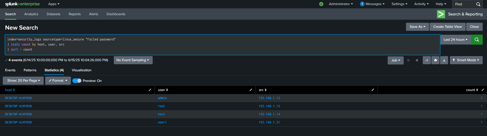

# Splunk Threat Detection

A project to detect failed SSH login attempts using Splunk.

## ✅ What This Project Covers

- Uploading Linux auth logs to Splunk
- Creating custom field extractions for usernames and IPs
- Writing SPL queries to detect suspicious login attempts
- Visualizing failed logins
- (Optional) Creating alerts and dashboards

## 📁 Project Structure

| Folder | Description |
|--------|-------------|
| `logs/` | Sample Linux auth log data (`auth.log`) |
| `queries/` | SPL queries for detecting threats |
| `screenshots/` | UI results from Splunk searches |
| `extras/` | Regex and other helper config files |

## 🔍 Sample SPL Query

```spl
index=security_logs sourcetype=linux_secure "Failed password"
| stats count by host, user, src
| sort - count




